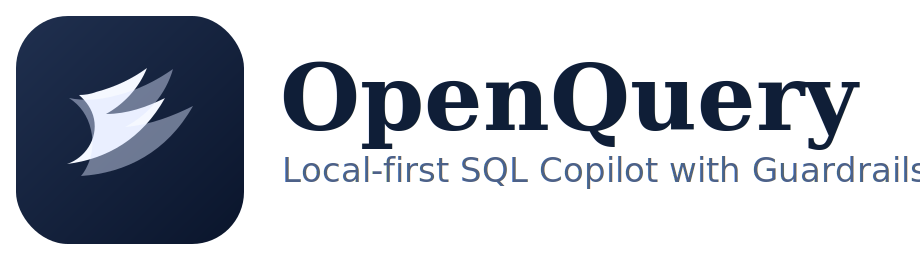
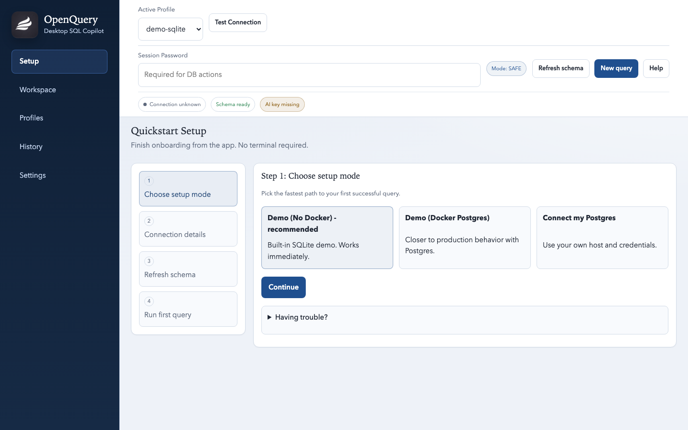
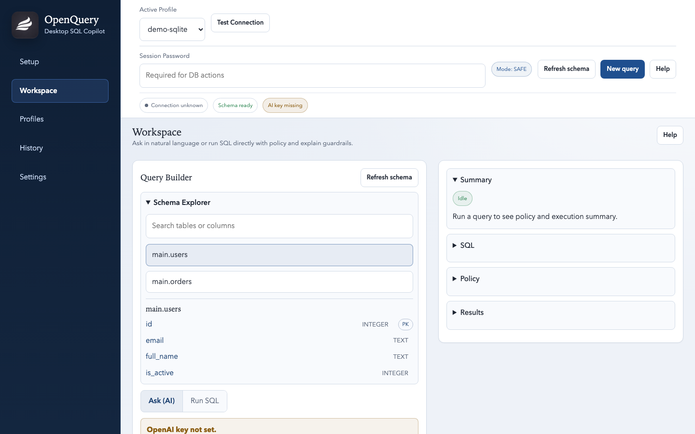
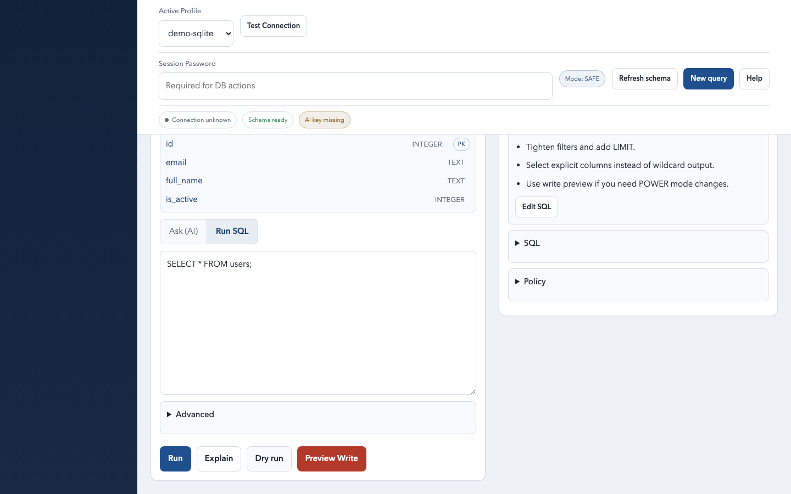
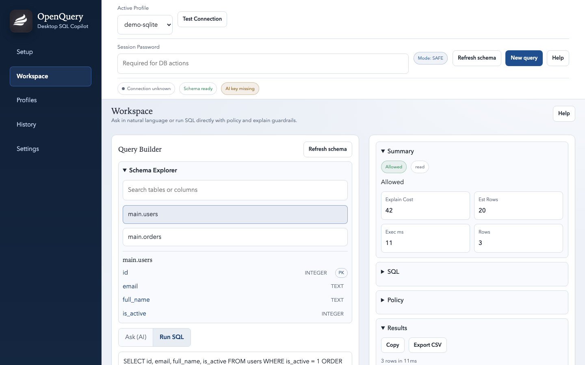
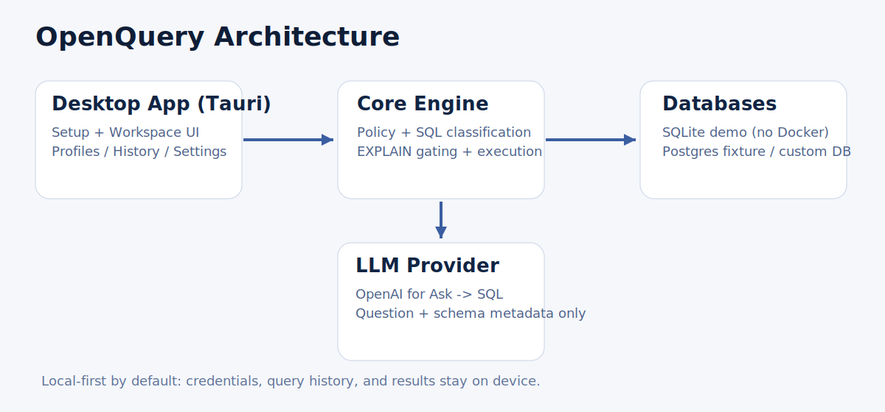

<div align="center">
  

  <p><strong>Local-first SQL copilot for teams that need speed with guardrails.</strong></p>

  <p>
    <a href="https://github.com/faridktx/OpenQuery/actions/workflows/lint-typecheck.yml"></a>
    <a href="https://github.com/faridktx/OpenQuery/actions/workflows/unit-tests.yml"></a>
    <a href="https://github.com/faridktx/OpenQuery/actions/workflows/integration-postgres.yml"></a>
    <a href="https://github.com/faridktx/OpenQuery/actions/workflows/desktop-build.yml"></a>
    <a href="LICENSE"></a>
  </p>

  <p>
    <a href="docs/README.md">Docs</a> ·
    <a href="docs/recruiter-demo.md">2-Minute Demo</a> ·
    <a href="docs/security.md">Security</a> ·
    <a href="CONTRIBUTING.md">Contributing</a>
  </p>
</div>

## What Is OpenQuery?
OpenQuery is a desktop + CLI SQL copilot for safe database access.

- Ask in natural language, or run SQL directly.
- Apply policy guardrails before execution.
- Keep profiles, schema snapshots, history, and audit data local-first.

## Why It Exists
Teams want AI-assisted querying, but do not want unbounded query risk.

- Plain text-to-SQL tools often skip policy and EXPLAIN checks.
- Analysts need speed, but engineering needs control and auditability.
- Desktop workflows should work with and without Docker.

## Key Features
- Desktop app (Tauri) with Setup, Workspace, Profiles, History, and Settings
- First-run Quickstart (No-Docker SQLite demo or Docker Postgres demo)
- Guardrails: SQL classification, select-star checks, limit enforcement, blocked-table controls
- EXPLAIN gating in safe mode
- POWER mode with write preview + typed confirmation
- In-app OpenAI key management (env var remains optional fallback)
- Shared core package used by both desktop and CLI
- Eval harness and benchmark scripts for regression tracking

## Screenshots






## 2-Minute Quickstart (Desktop)
### Option A: No-Docker demo (recommended)
```bash
pnpm install
pnpm --filter @openquery/desktop dev:tauri
```

Then in the app:
1. Open `Setup`.
2. Choose `Demo (No Docker)`.
3. Click `Create demo profile`.
4. Click `Refresh schema`.
5. Run the first query from Setup or Workspace.

### Option B: Docker Postgres demo
```bash
docker info
OPENQUERY_PG_PORT=55432 pnpm smoke:docker
pnpm --filter @openquery/desktop dev:tauri
```

Then in `Setup`, choose `Demo (Docker Postgres)` and click `Start`.

Full recruiter flow: `docs/recruiter-demo.md`

## Quickstart (CLI)
```bash
pnpm -C apps/cli build
node apps/cli/dist/main.js --help
node apps/cli/dist/main.js doctor
```

Detailed CLI usage: `docs/cli.md`

## How It Works


- `apps/desktop`: Tauri frontend + Rust bridge commands
- `apps/cli`: terminal interface
- `packages/core`: policy engine, adapters, ask/run orchestration, local storage
- `infra/docker`: Postgres fixture and seed data

## Guardrails and Safety Model
- Safe mode validates and can block risky SQL before execution.
- EXPLAIN gating adds cost/row-risk checks.
- POWER mode requires explicit confirmation for writes.
- Local-first boundary keeps credentials and result rows local.

Details: `docs/security.md`, `docs/threat-model.md`

## Repository Structure
```text
OpenQuery/
├─ apps/
│  ├─ cli/
│  └─ desktop/
├─ packages/
│  ├─ core/
│  └─ eval/
├─ infra/
│  └─ docker/
├─ scripts/
├─ docs/
└─ assets/
```

## Roadmap (Current)
- Improve desktop onboarding and readability polish
- Expand policy presets and profile-level defaults
- Add richer eval datasets for SQL safety regressions
- Harden CI release workflow for desktop artifacts

## Contributing
Start with:
- `docs/dev-setup.md`
- `docs/README.md`
- `CONTRIBUTING.md`

Core checks:
```bash
pnpm -r build
pnpm -r test
pnpm lint
pnpm typecheck
```

## License
MIT. See `LICENSE`.
